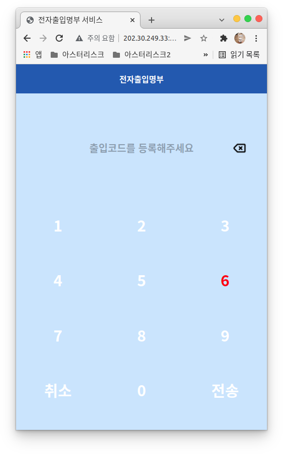
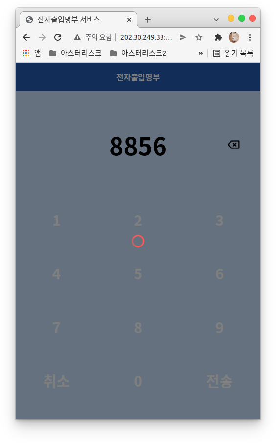
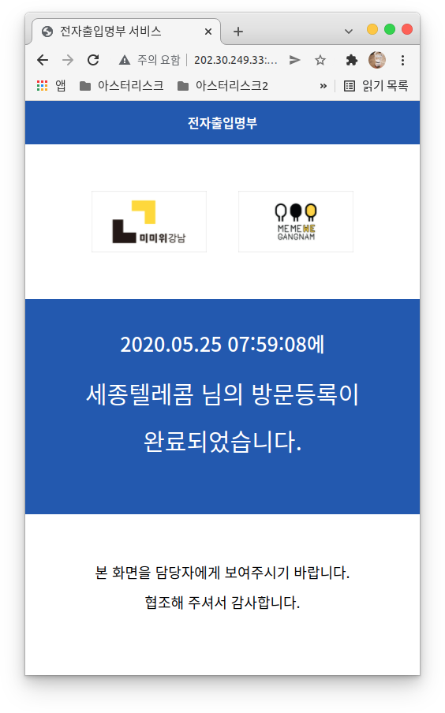
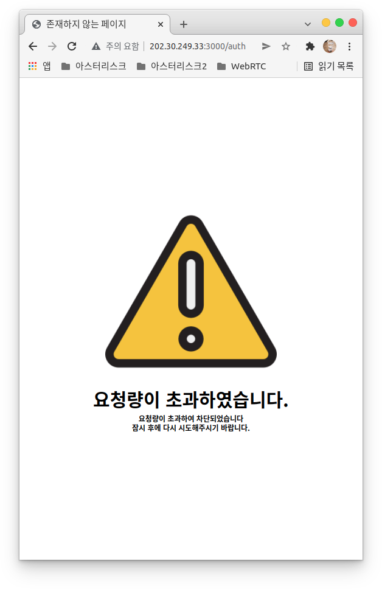
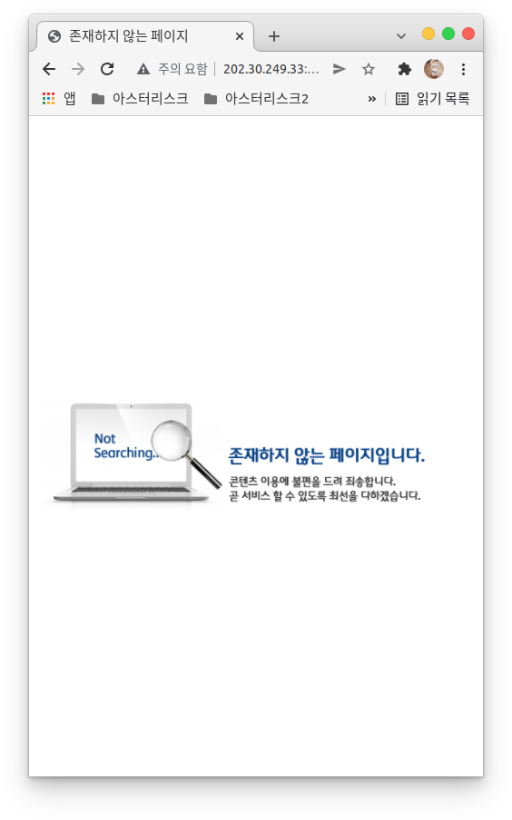

# 전자출입명부 웹페이지

강남구청에서 의뢰받은 것으로, 전화로 인증을 하는 도중 DTMF의 잘못된 번호 입력 혹은 성공적으로 제출이 되지 않은 경우, 사용자에게 현재 이 페이지를 제공합니다.

전자 출입명부 웹페이지는 비정상적인 접근을 제어하기 위해 사용자의 번호 및 출입번호로 이루어진 aes 암호화 된 url을 사용합니다.

 

## 목차

1. 코드 수정 방법
2. 실행 방법

 

## 코드 수정 방법

1. 프론트 : ejs 파일은 views 디렉토리에 생성되어 있음. 나머지는 public 디렉토리
2. 백엔드 : express 라이브러리를 사용하고 있음.

 

## 실행 방법

1. 수정코드 적용 : npm run-script build
2. 상용: pm2 start npm --name "AccessListWeb" -- start
3. 테스트: pm2 start npm --name "AccessListWebDEV" -- teststart

 

## 기타 명령어

1. 실행중인 앱 리스트 : pm2 list
2. 앱 중단 : pm2 stop AccessListWeb
3. 앱 다시시작 : pm2 restart AccessListWeb

 

## 업데이트 목록

1. express html -> ejs
2. webpack 및 난독화
3. ddos 방어 및 시간당 요청 수 제한
4. 동시접속자 및 세션 제어
5. db 동시 접근 제어
6. 에러 페이지 적용
7. aes 암호화 적용
8. 데이터베이스 설정 파일 추출
9. 로그 출력

 

## 데이터베이스 설정방법

1. const/db.ini 폴더 수정
2. 테이블 정의는 아래와 같습니다. 테스트 용도이기 때문에 변경하시기 바랍니다.

 

<code>
CREATE TABLE TEST1 (
    cid varchar(30),
    did varchar(30),
    accessCode char(4),
    date Timestamp
)
</code>

 

<code>
CREATE TABLE URLDATE (
    url varchar(300),
    date Timestamp
)
</code>

 

## 페이지 결과

